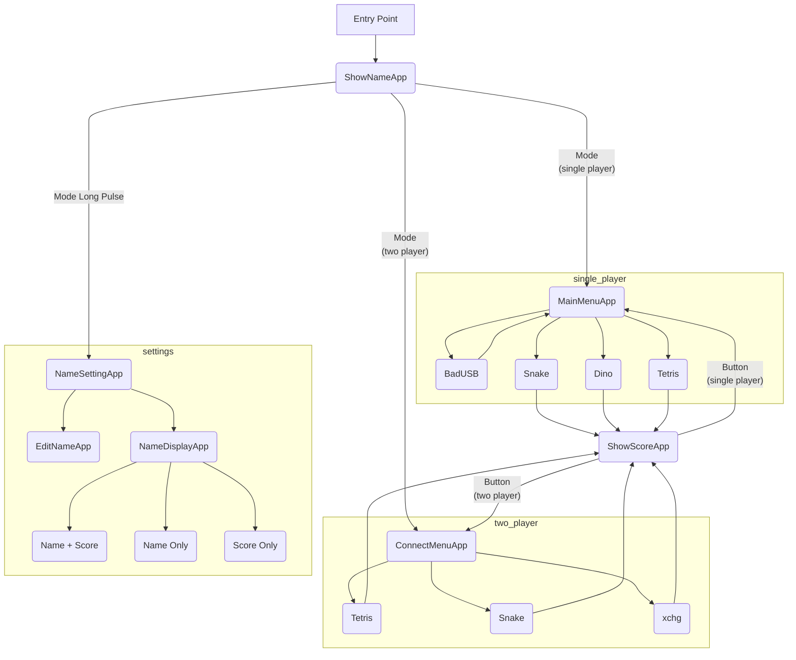

```mermaid
flowchart TD
    A[Entry Point] --> B(ShowNameApp)
    B -----> |"Mode\n(single player)"| main_menu_app(MainMenuApp)

    subgraph single_player
        main_menu_app --> D(BadUSB)
        main_menu_app --> E(Snake)
        main_menu_app --> F(Dino)
        main_menu_app --> G(Tetris)
    end

    D --> main_menu_app
    E --> show_score_app
    F --> show_score_app
    G --> show_score_app
    show_score_app(ShowScoreApp) --> |"Button\n(single player)"| main_menu_app

    B -----> |"Mode\n(two player)"| connect_menu_app(ConnectMenuApp)
    subgraph two_player
        connect_menu_app --> O(Tetris)
        connect_menu_app --> P(Snake)
        connect_menu_app --> Q(xchg)
    end

    O --> show_score_app
    P --> show_score_app
    Q --> show_score_app
    show_score_app --> |"Button\n(two player)"| connect_menu_app

    B ------> |Mode Long Pulse| H(NameSettingApp)
    subgraph settings
        H --> I(EditNameApp)
        H --> J(NameDisplayApp)
        J --> K(Name + Score)
        J --> L(Name Only)
        J --> M(Score Only)
    end
```
