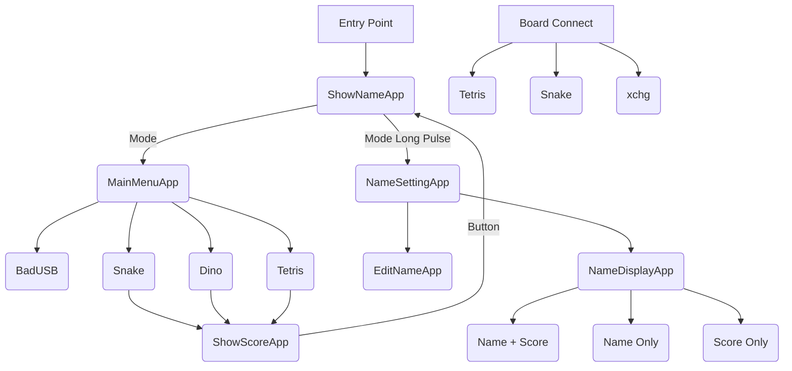

```mermaid
flowchart TD
    A[Entry Point] --> B(ShowNameApp)
    B --> |Mode| C(MainMenuApp)
    C --> D(BadUSB)
    C --> E(Snake)
    C --> F(Dino)
    C --> G(Tetris)
    B --> |Mode Long Pulse| H(NameSettingApp)
    H --> I(EditNameApp)
    H --> J(NameDisplayApp)
    J --> K(Name + Score)
    J --> L(Name Only)
    J --> M(Score Only)
    N[Board Connect] --> O(Tetris)
    N --> P(Snake)
    N --> Q(xchg)
    E --> R(ShowScoreApp)
    F --> R
    G --> R
    R --> |Button| B
```
