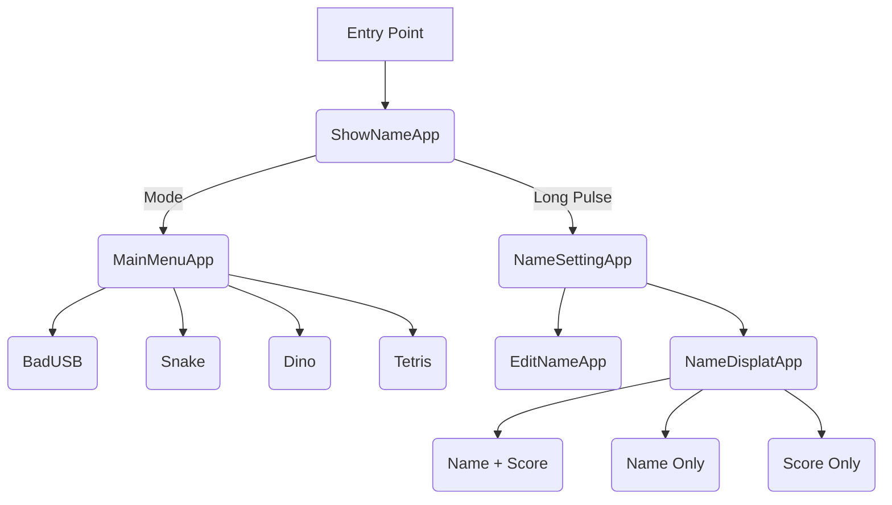

```mermaid
flowchart TD
    A[Entry Point] --> B(ShowNameApp)
    B --> |Mode| C(MainMenuApp)
    C --> D(BadUSB)
    C --> E(Snake)
    C --> F(Dino)
    C --> G(Tetris)
    B --> |Long Pulse| H(NameSettingApp)
    H --> I(EditNameApp)
    H --> J(NameDisplatApp)
    J --> K(Name + Score)
    J --> L(Name Only)
    J --> M(Score Only)
```
